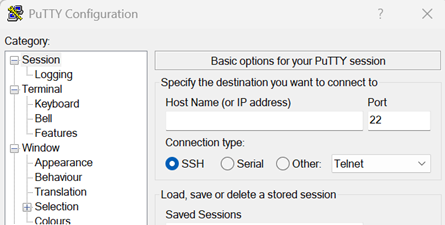
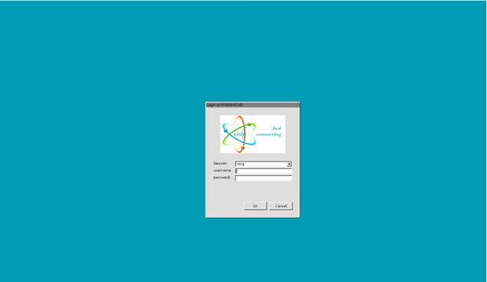
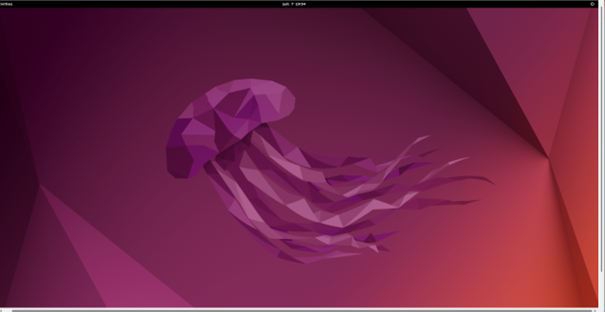
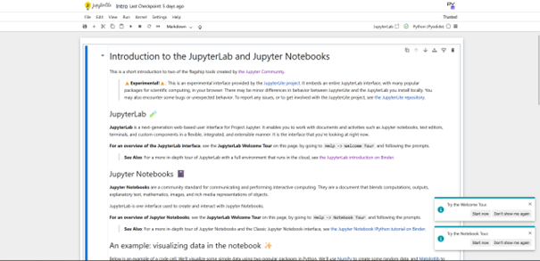
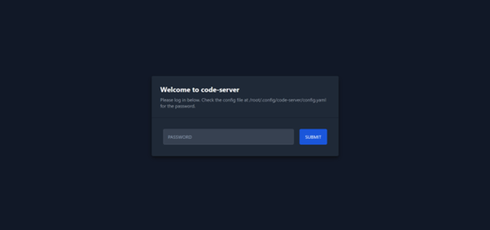
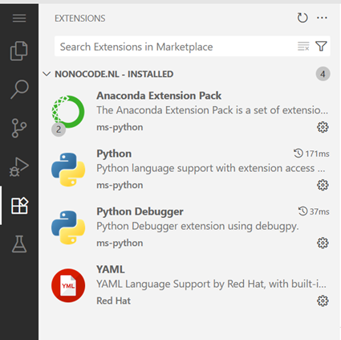
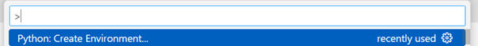
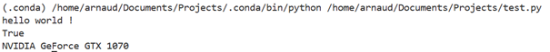

## Introduction

Using my own computer for my personal deep learning projects is annoying:
- **Limited usability**: I can’t really use my computer for anything else while I train neural networks.
- **Noise**: I also can’t turn off my computer during training, which means prolonged periods of loud fan noise.
To resolve this, I decided to explore how I could run my projects on a remote server. The result? I created my own website, allowing me to access an IDE [1] on the server. This way, I can code and train models directly from a web browser, anywhere, anytime.

Setting up this project took me about a weekend. In this post, I’ll walk you through the open source tools and tutorials I used to achieve this setup. 

## Step 1: choose a hosting service

The ideal server for deep learning applications should have:
- A GPU for backpropagation calculations 
- Plenty of storage for large datasets
- Adequate RAM for visualisations 

After reviewing several hosting providers, I chose Ikoula [2], a French hosting service, based on the following criteria:
- **Location**: Being hosted in the European Union, which ensures low latency and strong privacy laws.
- **Transparent billing**: I wanted a fixed monthly price for specified hardware, avoiding surprises from usage-based billing.
- **Affordability**: Since this is a hobby project, I didn’t mind using older hardware.

I selected the following server specifications:
•	Intel® Core™ i9-9900K @3,6 Ghz (8C/16T)
•	64 Go DDR4
•	1 x 1 To SSD NVMe
•	GPU : GeForce GTX 1070
•	OS : Ubuntu 22.04.5 LTS

While a GTX 1070 was released back in 2016, it should be sufficient for my needs. I don’t intend on training very large models. I opted for a bare metal hosting service [3], which means that I rent a physical server in a data centre and not a virtual machine or VPS [4]. 

## Step 2: Access your server

### Putty
To remotely access the server, I used Putty [5], an open source SSH client. Once I received the root password from the hosting provider, I logged in and then created a user account, using the root account only when necessary.

While working from the command line interface on Ubuntu is fine, I wanted to explore connecting to a remote desktop for a more familiar development environment. Unfortunately, as I anticipated, latency was too high to make this practical for actual coding.
I upgraded the server to a desktop version of Ubuntu with this command line:
'''
sudo apt install ubuntu-desktop
'''

### Remote desktop

Afterwards, I used the Windows 10 remote desktop application to log in and access the graphical interface. However, I’ll primarily access the server via Putty or through the website for future work.

## Step 3: Install the server IDE

After experimenting with Jupyter Lab [6] and its notebooks, I chose to use code-server [7], a VS code [8] server that can be accessed via a web browser. I followed the installation instructions [9] and installed it using the provided script.

Once installed, code-server runs locally on localhost:8080. For security reasons, it is password-protected by default. If you decide to expose it to the internet, always ensure it is behind a password protection to prevent unauthorised access [10].

## Step 4: Set up your website (optional)

While it’s possible to access code-server directly via its IP address, I opted to purchase a domain name from Spacesquare [11]. I selected the latter because it was recommended in a tutorial and used to be owned by Google. This is purely optional but using a URL is more user-friendly than typing an IP address. I also was curious about creating my own website, as I have never done it before.  
I then configured the DNS [12] settings, in my Spacesquare account, to map my domain to the server’s IP address using an A record (since I have an IPv4 address). This allows me to access the server via my custom URL.

## Step 5: Enable HTTPS

For security reasons, I decided to enable HTTPS  [13] rather than HTTP, the former encrypts communication between the server and the client. Initially, I used a self-signed certificate generated with openssl [14], as I didn’t yet have a domain name. While browsers issue a warning about the certificate, it is perfectly safe for personal use. 
Once I registered my domain, I used Let’s Encrypt from Nginx [16] to obtain a valid certificate for the domain, following the steps outlined in the code-server documentation [15]. This allowed me to access the server over HTTPS.

## Step 6: secure everything!

Since code-server provides privileged access to my server, I added an additional layer of security by configuring Nginx to password-protect the entire application. This is especially important if you haven’t changed the default password generated by code-server. I followed an online tutorial for this [17], and I strongly recommend others to do the same.

## Step 7: connect your GPU

In order to utilise the server’s GPU, I needed to install the correct drivers. By default, the server came with Nouveau drivers (an open-source alternative to NVIDIA drivers) [18]. However, I needed the proprietary NVIDIA drivers for deep learning frameworks like Pytorch [19]. 
This process was more challenging than expected due to compatibility issues between older hardware and newer software versions. I manually selected the appropriate driver version from NVIDIA’s website [20] and installed it using updated compilers. After some trial and error, I was able to install the drivers successfully. I confirmed that everything was working by running the '''nvidia-smi''' command, which shows the current load on the GPU.

## Step 8: Create virtual python environments

To manage my dependencies, I use Conda [22] to create Python environments. I installed the necessary Anaconda extensions in VS Code and followed the instructions to install Anaconda on the server [23]. 

Once Anaconda was installed on the server, I created a new environment using the VS Code command palette. I selected the desired Python version and was able to open a terminal with the corresponding Conda environment. I then installed the libraries I needed using pip [24].

Finally, I wrote a small script to verify that Cuda is available and to check which device is being used by PyTorch.

''' python 

import torch

print("hello world !")

print(torch.cuda.is_available())
print(torch.cuda.get_device_name(0))

'''

## Conclusion

After setting everything up, my server is now fully configured to run deep learning projects efficiently, securely  and remotely. The GPU is properly recognised and I can access everything through a web interface. This setup allows me to train models without worrying about overloading my personal machine.

## References

[1] https://en.wikipedia.org/wiki/Integrated_development_environment
[2] https://www.ikoula.com/
[3] https://en.wikipedia.org/wiki/Bare-metal_server
[4] https://en.wikipedia.org/wiki/Virtual_private_server
[5] https://www.putty.org/
[6] https://jupyterlab.readthedocs.io/en/latest/
[7] https://github.com/coder/code-server
[8] https://code.visualstudio.com/
[9] https://github.com/coder/code-server/blob/main/install.sh
[10] https://coder.com/docs/code-server/guide
[11] https://www.squarespace.com/
[12] https://fr.wikipedia.org/wiki/Domain_Name_System
[13] https://en.wikipedia.org/wiki/HTTPS
[14] https://jupyter-notebook.readthedocs.io/en/6.2.0/public_server.html
[15] https://coder.com/docs/code-server/guide#using-lets-encrypt-with-nginx
[16] https://nginx.org/
[17] https://medium.com/@nickjabs/secure-your-app-with-nginx-basic-authentication-94db2d28d154
[18] https://nouveau.freedesktop.org/
[19] https://pytorch.org/
[20] https://www.nvidia.com/en-us/drivers/
[21] https://forum.ubuntu-fr.org/viewtopic.php?id=2085794
[22] https://www.anaconda.com/
[23] https://www.anaconda.com/docs/getting-started/anaconda/install#linux-installer
[24] https://pypi.org/project/pip/
