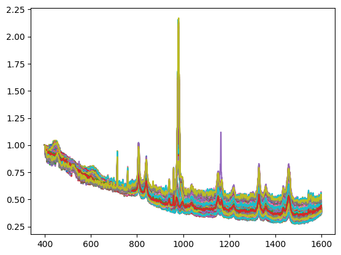

##  Introduction
I found The Dig4Bio Raman Transfer learning challenge on [Kaggle](https://www.kaggle.com/competitions/dig-4-bio-raman-transfer-learning-challenge/overview). It caught my eye because it is a European Union initiative to advance in the field of chemistry thanks to AI contributions. Furthermore, the challenge states that little data is available, which makes it even more interesting to me because solving the challenge is more about good algorithm design and not purely hardware.
Raman spectroscopy is interesting because it is a relatively low-cost and a non-destructive method for estimating concentrations of molecules in samples through a spectrum. However, algorithms designed for concentration prediction are machine-specific and fail to generalise across instruments. The challenge is to design an algorithm that successfully generalises predictions across machines from little data. More specifically concentrations of glucose, acetate, and magnesium sulphate are to be predicted. 
 
---

## Description of the data
The data came from 9 different Raman instruments, each producing spectra with varying formats, resolutions, and signal-to-noise ratios. Furthermore, there were slight errors between the wavelengths displayed in the data tables and in the articles describing the data. 
 
 

I made the hypothesis that the raw data was correct. Finally, since the data came from two sources, the authors of the challenge added a supplementary spectrum measurement by sample, which is useful because of the little data available but induces a data unbalance compared to other samples.

Two Raman spectra of the same concentration sample but of different machines do not look alike (see figures).
 
 

---

## Data Preprocessing: my approach to messy data

I built a custom `DataLoader` to:
- Parse all CSV formats robustly.
- Align spectra onto a **common wavelength grid** (400–1600 cm⁻¹, 1200 points). I chose the wavelengths according to the spectral lines of the chemicals that are to be identified and the overlaps between samples from different machines. I also replaced the arbitrary float sampling with one sample per integer between 400 and 1600 cm-1. This is arbitrary but helps the AI reason with the same datapoints for each sample, which is crucial for learning consistent features.
- Apply **per-spectrum scaling** from the first spectrum point and **Savitzky-Golay smoothing** to reduce noise while preserving peak structure. These techniques are common in the literature of Raman spectra analysis.
- Combine all training datasets into a unified DataFrame.
I chose to consider several passes of the same concentration as separate spectra. 

This modular preprocessing step was crucial to ensure data consistency before modelling. The first figure shows the raw data. The next illustrates the cut and resampled version, and the final one shows the scaled and smoothed result.

 
 
 
---

## Data Augmentation: a pivotal point of my strategy 
There are only 2453 spectra in the sample provided for this competition. Furthermore, traditionally, the data has to be split into a training, a validation and a test set. I thus have considered two actions in my strategy:
- Using lightweight networks and if possible pretrained-networks
- Relying heavily on data augmentation, meaning adding noise and slightly modifying the input data to artificially create diversity in the training set so that the network won’t overfit on input samples.
Note: data augmentation is not activated during the validation step because the goal is to tell whether the network performs well on the real data. 

To enhance generalization, I implemented a custom `SpectrumAugmenter` with domain-specific transformations:
- Gaussian noise
- Spectral shifting
- Smoothing with Gaussian kernels
- Scaling and baseline drift
During training, spectra can be altered using one or more data augmentation techniques. Each transformation has a chance of being applied.
---

## Neural network: U-Net 1D with Multi-Head Regression

U-net is my go-to architecture for image processing tasks, in particular semantic segmentation. During research for this project, I found out there is a 1 dimensional [implementation](https://huggingface.co/docs/diffusers/main/api/models/unet) that is tailored for time-series data. 
 

I also implemented separate regression heads for concentration prediction, which means each target is predicted by its own linear layer, isolating the learning process for each chemical.

The model was implemented in PyTorch and I adapted the Hugging Face implementation to implement dropout. Dropout randomly removes a percentage of neurons during training to force the network to be robust.

---

## My training strategy
I have implemented a custom loss that takes into account the mean squared error loss as well as the R2 score. This encourages convergence toward the predicted true targets, while preserving correlation patterns.
Furthermore, I used a stratified validation split based on quantiles of the average target values, which tends to sample validation data uniformly amongst the data available. The goal is to have a representative validation set and because there is little data available, to minimise the validation set size as much as possible.
I also implemented a standard scaler on targets, forcing them to be in the 0,1 range. This helps the regression stabilise during backpropagation.
Furthermore, I implemented a mechanism that saves the best model based on the best validation R2 and not just loss. This is justified by the goal of the challenge that evaluates outputs based on R2 score.
Finally, I performed a grid search over various parameters, including loss functions, validation split size, learning rates, and number of epochs and published the best model on Kaggle. Given the limited data, I opted for relatively short training cycles (100–300 epochs) to avoid overfitting.
---
## Inference strategy
Since each sample was measured twice, I infer the model twice independently and then average the results for submission. 
## Results
On the public leaderboard, my best model achieved, as of now, a R2 score of 0.74910, which corresponds to third place.
Once the competition is completed, I will publish my code to GitHub in a public repository. 
---
## Way forward
Through my experiments, I noticed that magnesium sulphate seems very easy to predict, while glucose — and especially sodium acetate — were harder to predict. Looking at a spectrum, magnesium sulphate corresponds to two peaks that are quite easily identifiable, while glucose and sodium acetate have several peaks across the spectrum that seem at lower intensities. 
Looking at the learning curves, the validation R2 of magnesium converges almost immediately after 10 epochs. However sodium acetate reaches a maximum at around 0.7 after more than a hundred epochs. 
I’ve identified several potential improvements:
- Changing the loss to a weighted loss or an adaptive loss that would rebalance the harder task of regressing the sodium acetate during backpropagation
- Changing the architecture of my network to allow better global representations of peaks of interest that must be considered in regression. I could perhaps implement attention mechanisms in the Unet bottleneck to link peaks together. 
- I also have identified the lack of data as a main issue for this challenge. I could revisit the data augmentation pipeline and validation set creation algorithms.
---
## Key Takeaways
- Raman spectra differ significantly across instruments, requiring robust preprocessing.
- A shared wavelength grid and smoothing helped standardize inputs across devices.
- Data augmentation and a lightweight 1D U-Net helped prevent overfitting on the small dataset.
- Using separate regression heads and a custom loss improved R² scores for individual targets.
- My best model reached 0.7491 R² on the public leaderboard (3rd place).

Thanks for reading!  
Feel free to reach out if you want to discuss the challenge with me.
